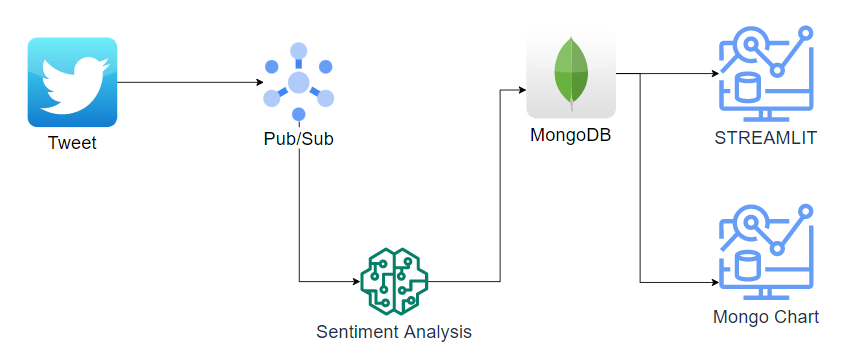
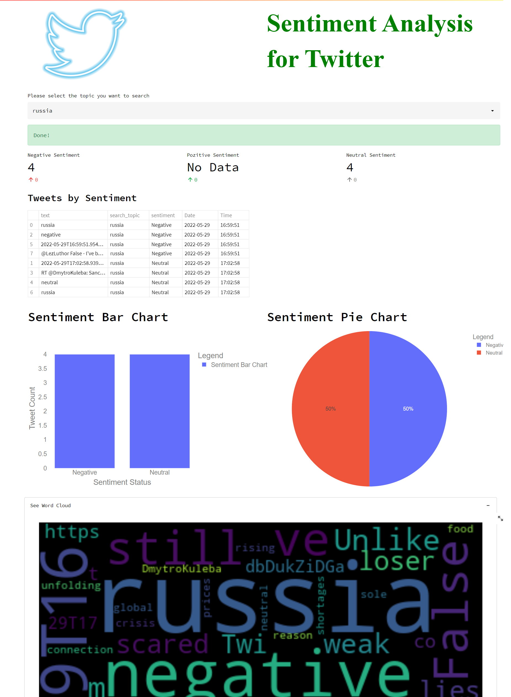

# Real-Time Sentiment Analysis for Tweets

In this application we will do real-time sentiment analysis using GCP. 

First, we will record the tweets shared on Twitter on MongoDB. In doing so, we will also have performed an sentiment analysis of the tweets. Then we will develop a dashboard that visualizes the sentiment states of the tweets we have recorded.

Example [chart](https://charts.mongodb.com/charts-project-0-dfwtt/public/dashboards/82a2a4fc-754e-4a37-a604-be401aa4e938)

## Project Structure



## Prerequisites
1. Create [GCP](https://cloud.google.com) account.
2. Create [MongoDB](https://www.mongodb.com/) Cluster. 
3. Create [Twitter](https://developer.twitter.com/en) developer account


## Setup Instructions

1. Clone the repository into a new directory on your machine.
2. Create config.ini file in the main file.
```ini
# Account Credentials

[mongo]
uri = uri
database = database
collection = collection

[twitter]
consumer_key        = #####################
consumer_secret     = #####################
access_token        = #####################
access_token_secret = #####################

[googlecloud]
credentials_path = credentials_path
topic_path = topic_path
subscription_path = subscription_path

[gevent]
timeout = 10
```
3. Create a file named gcp in the new directory. Then paste on the json file with google cloud platform user key info.
```json
"""Example keys.json file. """

{
  "type": "service_account",
  "project_id": "",
  "private_key_id": "",
  "private_key": "",
  "client_email": "",
  "client_id": "",
  "auth_uri": "",
  "token_uri": "",
  "auth_provider_x509_cert_url": "",
  "client_x509_cert_url": ""
}

```
4. Pull the image on [Docker Hub](https://hub.docker.com/repository/docker/buraksdocker/realtime_sentiment)
```sh
docker pull buraksdocker/realtime_sentiment

```
6. Run command

```sh
docker build -t realtime_sentiment:latest -f dockerfile
docker run -p 8501:8501 realtime_sentiment:latest

```

## Dashboard



